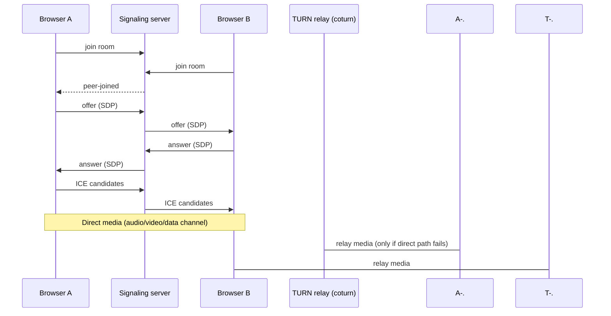

# Pulsly

Browser-based video calling. No accounts, no downloads — start a call, send the link.

**Live**: [pulsly.samdanymdahsanahmed.workers.dev](https://pulsly.samdanymdahsanahmed.workers.dev)

[](https://react.dev)
[](https://github.com/websockets/ws)
[](#cost)
[](LICENSE)

## What it does

- 1:1 video calls over a shared room link — no sign-up, no install
- Real NAT traversal via a self-hosted TURN relay, not just STUN (works across different
  networks — home wifi to cellular, corporate firewalls, the works)
- In-call text chat over a WebRTC data channel
- Screen sharing
- Mute / camera toggle, connection status, room-full and error handling

## How it works

The two browsers negotiate a direct WebRTC connection. The signaling server only ever
relays the *negotiation* — offers, answers, ICE candidates — as small JSON messages over a
WebSocket. It never touches audio or video. Once negotiation succeeds, media flows straight
between the two browsers, falling back to a TURN relay only when a direct path is blocked
(roughly 1 in 5 real-world connections, more on restrictive networks).



## Architecture

| Piece | What | Where | Cost |
|---|---|---|---|
| Client | React + TypeScript + Vite | Cloudflare Workers (static assets) | $0 |
| Signaling | Node.js + `ws`, plain WebSocket | Oracle Cloud Always Free VM | $0 |
| TURN / STUN | coturn, self-hosted | same VM | $0 |
| TLS | Let's Encrypt, auto-renewing | same VM, via nginx | $0 |
| Domain | DuckDNS dynamic DNS | `pulsly.duckdns.org` | $0 |

The signaling server mints its own short-lived TURN credentials using coturn's REST-auth
scheme (an HMAC over a shared secret that never leaves the server) and serves them from a
plain `/ice-servers` endpoint on the same port as the WebSocket — the client fetches fresh
credentials at the start of every call.

Both backend services run as systemd units (`pulsly-signaling`, `coturn`) so they restart on
crash and survive VM reboots.

## Cost

Everything runs on genuinely free tiers — no trials, nothing that starts billing later:

| Item | Provider |
|---|---|
| Compute (signaling + TURN) | Oracle Cloud Always Free |
| Static hosting | Cloudflare Workers |
| DNS + dynamic IP updates | DuckDNS |
| TLS certificates | Let's Encrypt |

**Total: $0/year.**

## Running it locally

Requires Node 20+.

```bash
npm install
npm run dev
```

This starts the signaling server on `ws://localhost:8080` and the client on
`http://localhost:5173`. Open the client in two browser tabs (or two devices on the same
network) — the first tab creates a room, the second joins it via the shared link.

To point your local client at a real deployed signaling server instead, copy
`client/.env.example` to `client/.env`:

```
VITE_SIGNALING_URL=wss://pulsly.duckdns.org
```

## Project layout

```
client/   React + TypeScript frontend (Vite), deployed to Cloudflare Workers
server/   WebSocket signaling server (Node + ws), self-hosted on the VM
```

## Deploying

**Client** — from `client/`:

```bash
npm run build
npx wrangler pages deploy dist --project-name=pulsly
```

**Server** — build (`npm run build` in `server/`), copy `dist/` to the VM, and restart the
`pulsly-signaling` systemd service. Environment variables it expects:

```
PORT=8080
PUBLIC_HOST=<VM public IP>
TURN_SECRET=<must match coturn's static-auth-secret>
```

## Status

Working and live: 1:1 calling, TURN relay, chat, screen share, permanent zero-cost hosting.

Not yet built: group calls (3+ people, would need a mesh or SFU), rate-limiting on the
signaling server, recording, accounts.

## License

[MIT](LICENSE)
