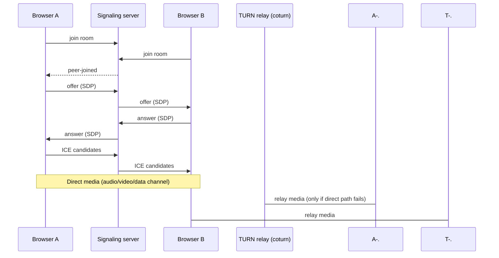

# Pulsly

Browser-based video calling. No accounts, no downloads — start a call, send the link.

**Live**: [pulsly.samdanymdahsanahmed.workers.dev](https://pulsly.samdanymdahsanahmed.workers.dev)

[](https://react.dev)
[](https://github.com/websockets/ws)
[](#cost)
[](LICENSE)

## What it does

- Video calls over a shared room link, up to 4 people — no sign-up, no install
- Real display names — set once, shown on both tiles instead of generic "You"/"Them"
- Real NAT traversal via a self-hosted TURN relay, not just STUN (works across different
  networks — home wifi to cellular, corporate firewalls, the works)
- In-call text chat and emoji reactions, both over the same WebRTC data channel
- Screen sharing — sent as its own video track alongside the camera (not a swap), so
  everyone still sees your face in a thumbnail while your screen is the main view
- Spotlight layout: whoever's presenting auto-fills the main view with everyone else as
  thumbnails below; pin anyone (including yourself) to feature them instead
- Live connection-quality indicator (good/fair/poor, from `RTCPeerConnection.getStats()`)
- Call duration timer
- Noise suppression, echo cancellation, and auto gain on the mic by default
- Keyboard shortcuts — `M` to mute, `V` for camera, `Esc` to close chat
- Light/dark theme, persisted per device
- Mute / camera toggle, connection status, room-full and error handling

## How it works

Every pair of browsers in a room negotiates its own direct WebRTC connection (full mesh —
with 4 people, that's 6 pairwise connections). The signaling server only ever relays the
*negotiation* for each pair — offers, answers, ICE candidates — as small JSON messages over
a WebSocket. It never touches audio or video. Once negotiation succeeds, media flows
straight between the two browsers, falling back to a TURN relay only when a direct path is
blocked (roughly 1 in 5 real-world connections, more on restrictive networks). The diagram
below shows one pair — every other pair in the room does the same exchange independently.



## Architecture

| Piece | What | Where | Cost |
|---|---|---|---|
| Client | React + TypeScript + Vite | Cloudflare Workers (static assets) | $0 |
| Signaling | Node.js + `ws`, plain WebSocket | Oracle Cloud Always Free VM | $0 |
| TURN / STUN | coturn, self-hosted | same VM | $0 |
| TLS | Let's Encrypt, auto-renewing | same VM, via nginx | $0 |
| Domain | DuckDNS dynamic DNS | `pulsly.duckdns.org` | $0 |

The signaling server mints its own short-lived TURN credentials using coturn's REST-auth
scheme (an HMAC over a shared secret that never leaves the server) and serves them from a
plain `/ice-servers` endpoint on the same port as the WebSocket — the client fetches fresh
credentials at the start of every call.

Both backend services run as systemd units (`pulsly-signaling`, `coturn`) so they restart on
crash and survive VM reboots.

The signaling server rate-limits by client IP: new WebSocket connections, messages per
connection, and `/ice-servers` credential requests all have sliding-window caps, enforced
server-side with an in-memory limiter (no extra service needed at this scale). Port 8080
itself is only reachable from `localhost` on the VM — nginx is the sole path in from the
internet, so those limits can't be dodged by connecting directly and forging the client-IP
header nginx would normally set.

## Cost

Everything runs on genuinely free tiers — no trials, nothing that starts billing later:

| Item | Provider |
|---|---|
| Compute (signaling + TURN) | Oracle Cloud Always Free |
| Static hosting | Cloudflare Workers |
| DNS + dynamic IP updates | DuckDNS |
| TLS certificates | Let's Encrypt |

**Total: $0/year.**

## Running it locally

Requires Node 20+.

```bash
npm install
npm run dev
```

This starts the signaling server on `ws://localhost:8080` and the client on
`http://localhost:5173`. Open the client in two browser tabs (or two devices on the same
network) — the first tab creates a room, the second joins it via the shared link.

To point your local client at a real deployed signaling server instead, copy
`client/.env.example` to `client/.env`:

```
VITE_SIGNALING_URL=wss://pulsly.duckdns.org
```

## Project layout

```
client/                 React + TypeScript frontend (Vite), deployed to Cloudflare Workers
  src/
    pages/               Home and Room — the two top-level views
    hooks/               useCall (all WebRTC/signaling logic), useTheme, useDisplayName
    lib/                 ice-servers fetch, shared signaling message types
    components/          icons.tsx (hand-drawn SVG icon set), Logo.tsx (brand mark)
    App.tsx              route switch between Home and Room
    main.tsx, index.css  entry point, design tokens, theme variables

server/                 WebSocket signaling server (Node + ws), self-hosted on the VM
  src/
    index.ts             room/signal relay + the /ice-servers TURN-credential endpoint
    rate-limit.ts        in-memory sliding-window limiter
    types.ts             shared message types
```

## Deploying

**Client** — from `client/`:

```bash
npm run deploy
```

(runs the build, then `wrangler deploy` — Cloudflare's Workers-based static-assets hosting,
configured in `client/wrangler.jsonc`.)

**Server** — build (`npm run build` in `server/`), copy `dist/` to the VM, and restart the
`pulsly-signaling` systemd service. Environment variables it expects:

```
PORT=8080
PUBLIC_HOST=<VM public IP>
TURN_SECRET=<must match coturn's static-auth-secret>
```

## Status

Working and live: group calling (full mesh, up to 4 people), TURN relay, chat, reactions,
screen share with spotlight/pin layout, connection quality, call timer, keyboard shortcuts,
light/dark theme, display names, a real logo, rate limiting, permanent zero-cost hosting.

Not yet built: recording, accounts.

## License

[MIT](LICENSE)
